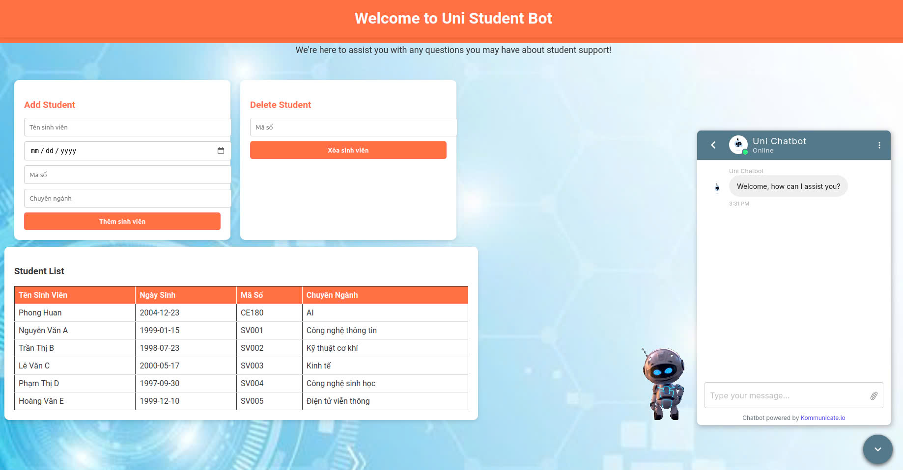
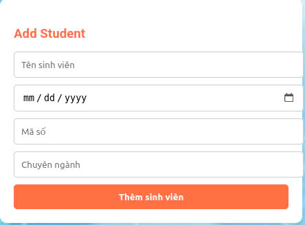
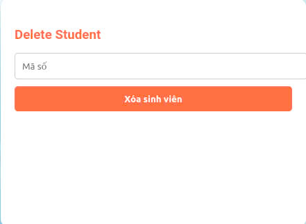

# Chatbot for University Student Assist 🤖🧑‍💻

  
# Including 2 main features
## **1. Chatbot Answer the question 💬**
The chatbot is developed using IBM Watson, a powerful platform for natural language processing, and is then designed and embedded into the website through the Kommunicate platform. 

  
## **2. Add and Delete Student 🙎‍♂️**
**Add Student**: This feature allows users to add new student names to the system, ensuring that the student list is always up to date.

  
  
**Delete Student**: This feature enables users to delete a student based on their unique ID. 

  
  
The results of the **Student list** will be updated every time a student is added or deleted.
